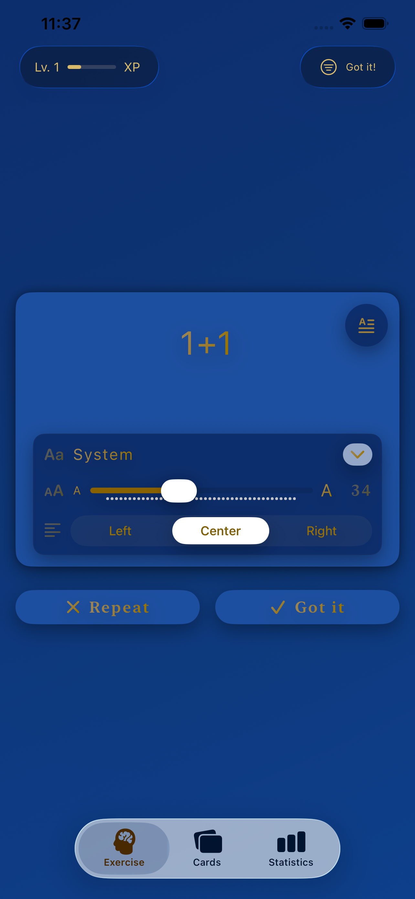
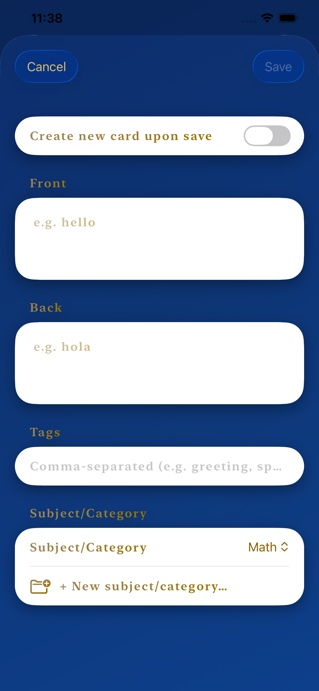
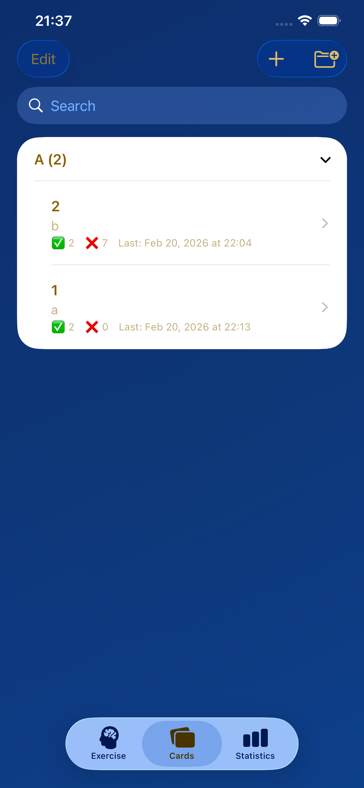
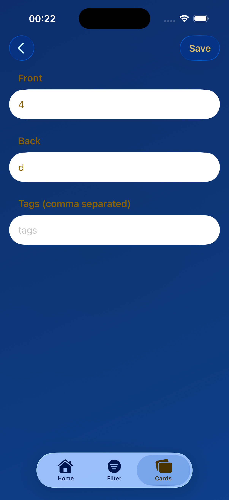
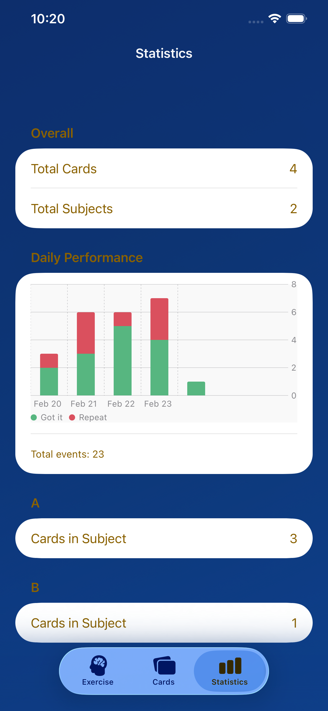
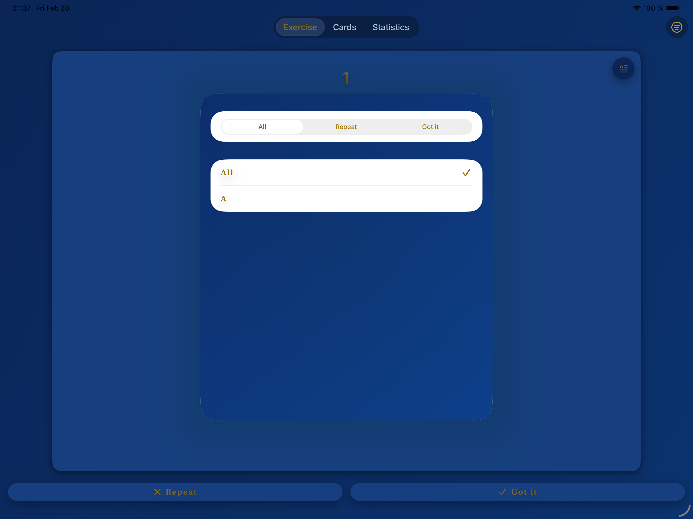
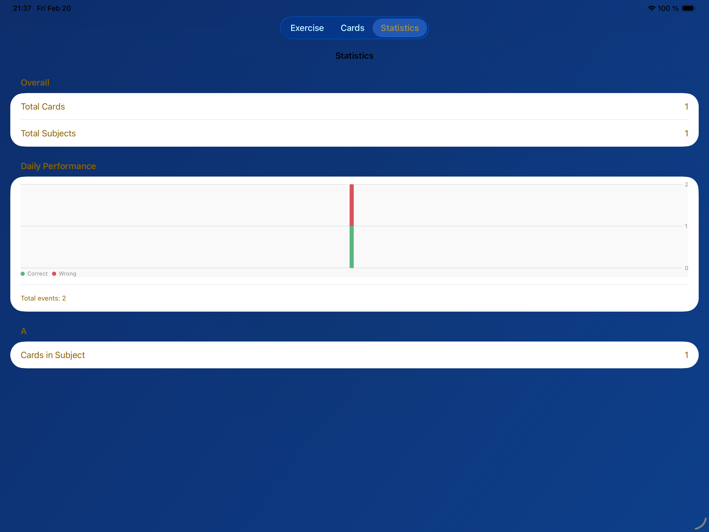

<p align="center"></p>

# Elorize

Elegant, minimalist flashcards with a Parisian-inspired design.

## iPhone

<p align="center">
  
  
  
  
  
  
  
  
  
  </p>

  ## iPad

  <p align="center">
  
  
  
  
</p>

---

## 📱 Features

- Elegant splash screen with animated, serif logotype
- Subject-based organization for flashcards
- Create flashcards with front/back multi-line text editors
- Add comma-separated tags to cards for easy filtering
- iPhone and iPad support with adaptive layouts
- Smooth toolbar actions for Cancel/Save throughout the app
- Background styling consistent across views

---

## 🔧 Requirements

- Xcode 26+
- iOS 17+
- Swift 5.9+

---

## 🚀 Installation

```bash
git clone https://github.com/herbstsonne/Elorize.git
cd Elorize
open Elorize.xcodeproj


