<p align="center">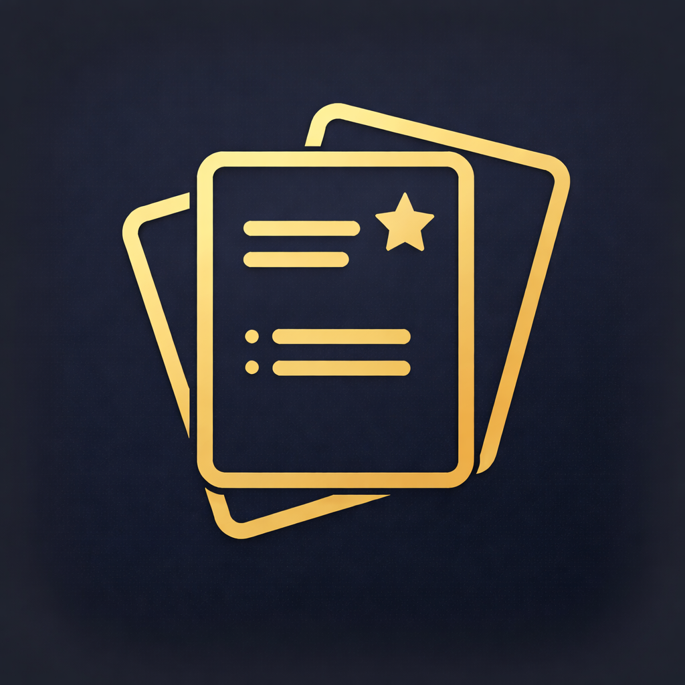</p>

# Gold & Ink

Elegant, minimalist flashcards with a Parisian-inspired design.

## iPhone

<p align="center">
  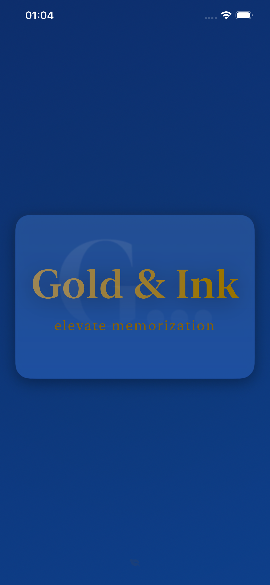
  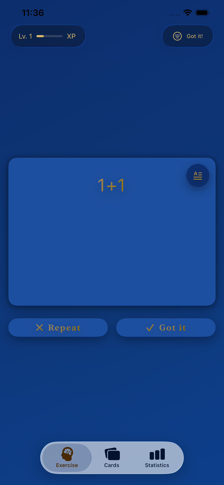
  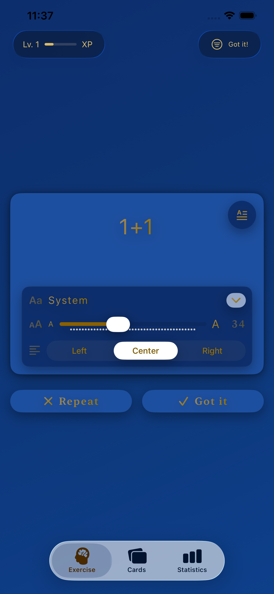
  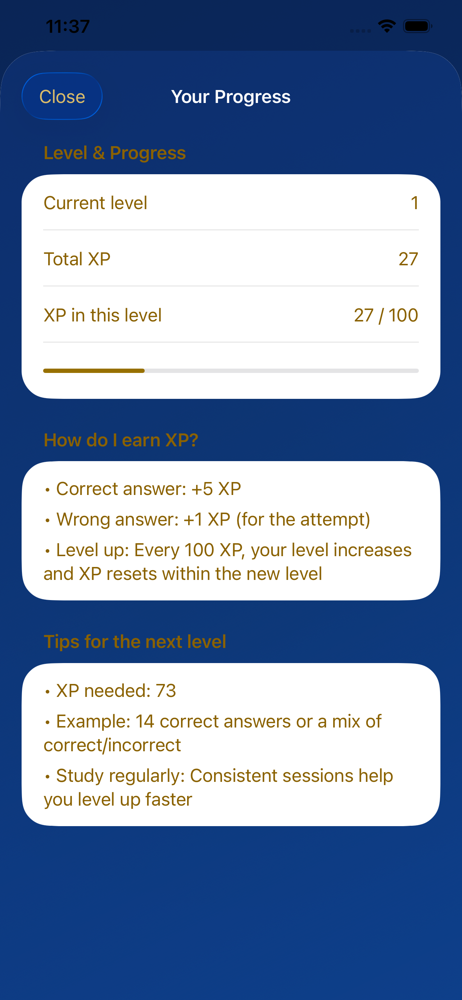
  
  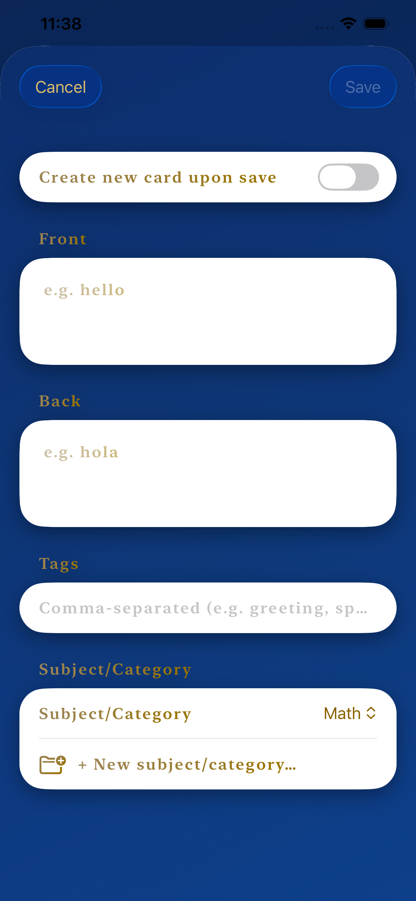
  
  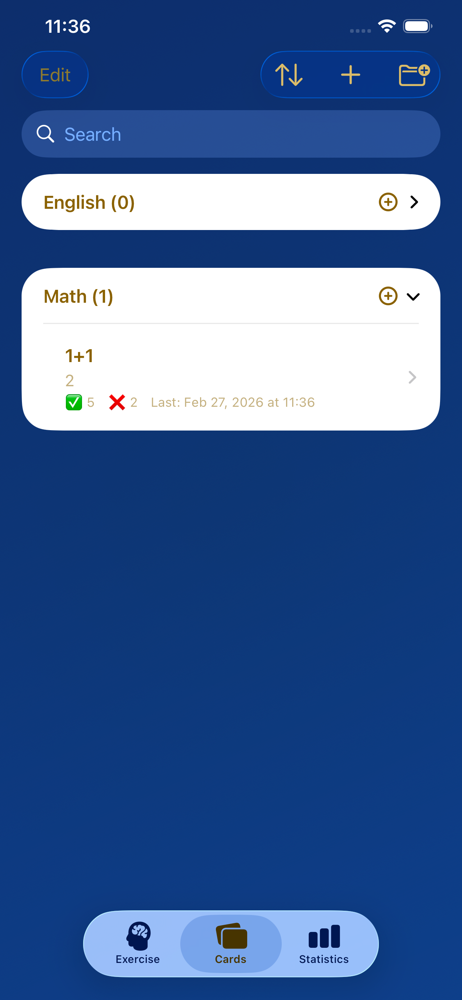
  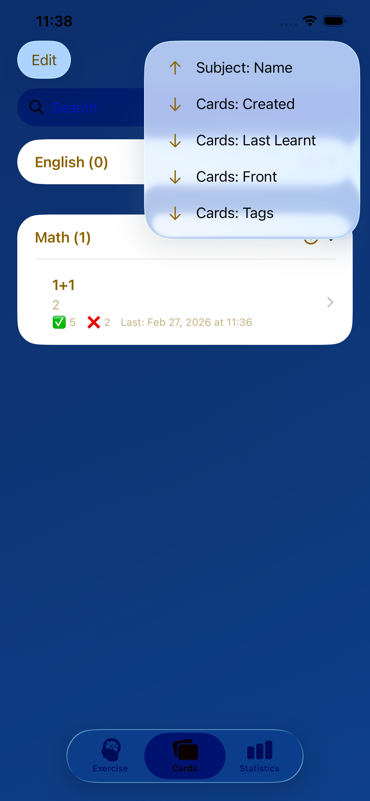
  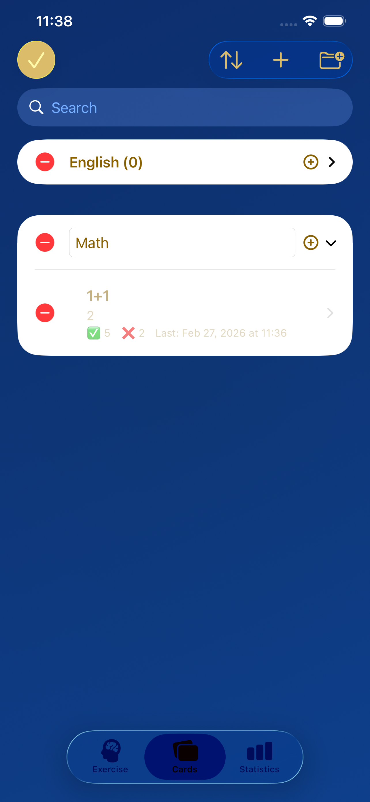
  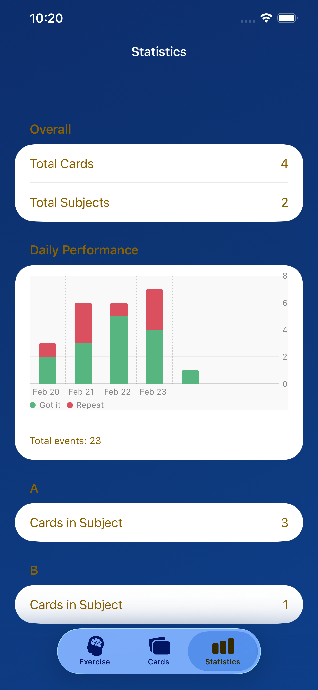
  </p>

  ## iPad

  <p align="center">
  
  
  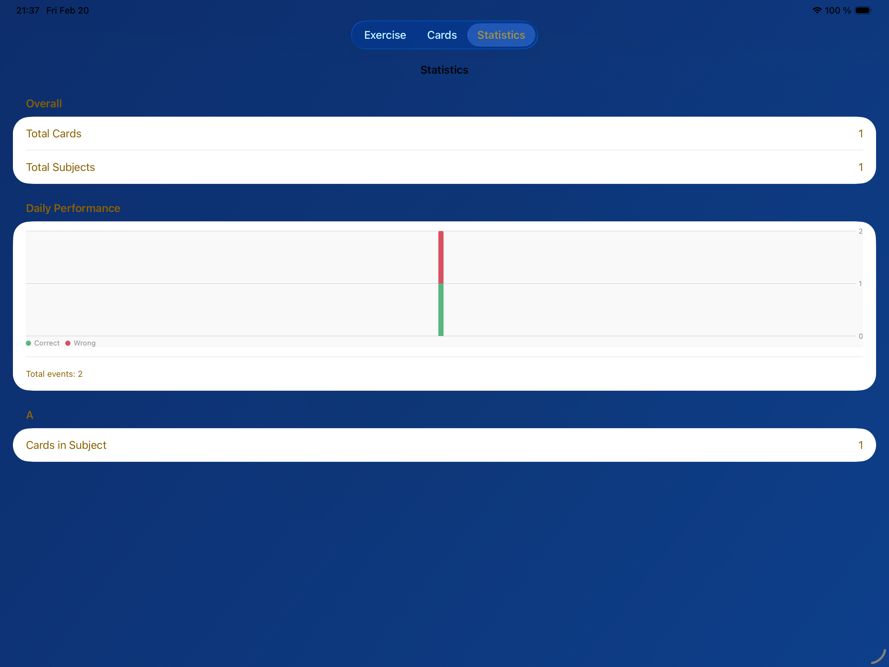
</p>

---

## 📱 Features

- Elegant splash screen with animated, serif logotype  
- Subject-based organization for flashcards (add, edit, delete subjects)  
- Create flashcards with multi-line front/back text editors  
- Add comma-separated tags to cards for flexible filtering  
- Filter by knowledge level (All, Repeat, Got it)  
- Filter by subject (including an "All" option)  
- Browse cards with clean, minimalist layouts  
- Edit cards inline (rename, update front/back, retag)  
- Sort cards with a dedicated sorting flow  
- Statistics view to track study progress over time  
- XP system that rewards study actions  
- Level progression tied to your accumulated XP  
- Smooth toolbar actions for Cancel/Save across sheets and forms  
- iPhone and iPad support with adaptive layouts  
- Consistent background styling and accent colors throughout  
- State persistence for filters (subject + knowledge) across sessions  
- Thoughtful defaults: "All" selection when no subject is chosen  
- Keyboard-friendly text entry for quick card creation  
- Dark Mode support  
- Localization-ready strings (where applicable)  

---

## 🔧 Requirements

- Xcode 26+
- iOS 17+
- Swift 5.9+

---

## 🚀 Installation

```bash
git clone https://github.com/herbstsonne/Elorize.git
cd Elorize
open Elorize.xcodeproj


